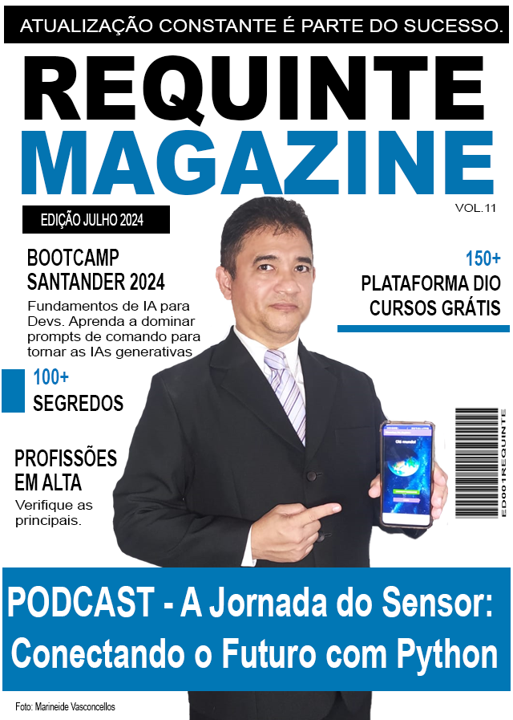

    preview do podcast

    <audio src="output/podcast_editado.MP3" controls title="Podcast editado"></audio>

# Projeto Podcast Gerado por I.A.s

 > ℹ️ **NOTE:** Este é o repositório desenvolvido durante um Bootcamp na [DIO](https://dio.me)

Projeto com o objetivo de gerar um podcast utilizando ferramentas de IA através de prompts mais trabalhados sendo copiloto para um humano.

Utilizei uma esteira de prompts para gerar cada etapa do processo criativo.

## 💻 Tecnologias utilizadas no projeto

- [ChatGPT](https://chat.openai.com/)
- [Capcut](https://www.capcut.com/pt-br/)
- [Photoshop portátil - Não precisa instalar](https://mega.nz/file/JqgQ3b7D#nBXAkWTnR5ss58pHgC1uLf1PPUJBsy-bLBREDEaPyOA)

## ✨ Como foi feito ?

- Roteiro gerado via chatgpt
- Audio gravado no Capcut
- Photoshop portátil para gerar capas
- Capcut para tratar aúdio e adicionar sons de fundo

## 📚 Materiais

- [Link da live no Youtube](https://www.youtube.com)
- [Notion Template](https://helpful-jump-17b.notion.site/PAS-Podcast-AI-Studio-210489e15d7a4a73b743bb159e45d06f?pvs=4)
- [Editor de aúdio](https://www.capcut.com/editor?from_page=landing_page&__action_from=picture_V%C3%ADdeos%20profissionais%20em%20minutos,%20n%C3%A3o%20em%20horas.)

## 🛠️ Instruções de execução

Utilize os prompts dentro do link do `Notion` fornecido na parte de `Materiais` para criar um podcast de maneira automatizada, para isso siga o passo a passo abaixo.

- 🤖 1. Use os prompts de roteiro no `chagpt`
- 🤖 2. Use os prompts de roteiro gerados pelo chatgpt para gravar seu próprio áudio
- 🤖 3. Use os prompts de artes no `midjourney` ou crie suas imagens no Photoshop

## 👨‍💻 Aluno

    
    
&nbsp&nbsp&nbspJosé Roberto Vasconcellos Lopes 
    &nbsp&nbsp&nbsp
    <a href="https://github.com/jrobertovl">GitHub</a>&nbsp;|&nbsp;
    <a href="www.linkedin.com/in/jrobertovl">LinkedIn</a>&nbsp;|&nbsp;
    <a href="https://www.instagram.com/jrobertovl/">Instagram</a>&nbsp;|&nbsp;
    <a href="https://api.whatsapp.com/send?phone=5591982003052">WhatsApp</a>

  

---

⌨️ com 💜 por [José Roberto Vasconcellos Lopes](https://github.com/jrobertovl)
